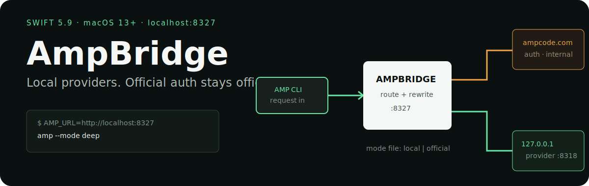

<p align="center">
  
</p>

# AmpBridge

AmpBridge is a small Swift TCP/HTTP bridge for running AMP against an existing local provider backend without redirecting AMP authentication, internal APIs, or unrelated provider routes away from `ampcode.com`.

## Proven routing boundary

The classifier and tests in this repository define the boundary:

| Request | Local mode | Official mode |
|---|---|---|
| `/auth/cli-login`, `/api/auth/cli-login` | `ampcode.com` | `ampcode.com` |
| `/api/internal…` | `ampcode.com` | `ampcode.com` |
| `/api/provider/anthropic/…` | local backend | `ampcode.com` |
| `/api/provider/openai/v1/responses…` | local backend as `/v1/responses…` | `ampcode.com` |
| other `/api/provider/openai/…` | local backend with prefix stripped | `ampcode.com` |
| `/v1/…`, `/api/v1/…` | local backend | local backend |
| other provider and unknown routes | `ampcode.com` | `ampcode.com` |

For OpenAI Responses, rewriting is enabled only when the upstream actually returns `text/event-stream`. Logical end markers are handled so downstream AMP clients can finish even if the upstream connection remains open. Raw-byte request parsing supports `Content-Length` and chunked bodies and rejects conflicting framing.

## Requirements

- macOS 13 or newer (declared by `Package.swift`)
- Swift 5.9 toolchain
- AMP CLI already authenticated
- an existing local provider backend listening on `127.0.0.1:8318`

AmpBridge does **not** implement provider login or browser OAuth. It only routes to a backend that is already working.

## Build and run

```bash
swift build
swift test
swift run ampbridge
```

The bridge listens on `127.0.0.1:8327` and keeps running in the foreground. In another terminal:

```bash
AMP_URL=http://localhost:8327 amp --mode deep
```

The effective chain in default local mode is:

```text
AMP CLI → localhost:8327 (AmpBridge) → 127.0.0.1:8318 (your provider backend)
```

## Switch provider routing without restarting

AmpBridge reads `~/.config/ampbridge/mode` for every request:

```bash
mkdir -p ~/.config/ampbridge
printf 'local\n'    > ~/.config/ampbridge/mode
printf 'official\n' > ~/.config/ampbridge/mode
```

Or set the initial mode and paths through environment variables:

```bash
AMPBRIDGE_PROVIDER_MODE=official swift run ampbridge
AMPBRIDGE_MODE_FILE=/tmp/ampbridge-mode swift run ampbridge
AMPBRIDGE_OPENAI_MODEL='your-model' swift run ampbridge
AMPBRIDGE_ANTHROPIC_MODEL='your-model' swift run ampbridge
```

`Scripts/amp-mode` can also switch AMP's settings between bridge/local, bridge/official, and native official modes:

```bash
bash Scripts/amp-mode bridge
bash Scripts/amp-mode official-api
bash Scripts/amp-mode native
bash Scripts/amp-mode status
```

> `amp-mode` edits the AMP settings file at `~/.config/amp/settings.json` (or `AMP_SETTINGS_FILE`) and sets `amp.dangerouslyAllowAll` when it creates a new file. Review the script and resulting settings before using it.

## Streaming and performance evidence

The repository's recorded May 2026 local benchmark compares the same bridge/local OpenAI Responses prompt before and after replacing byte-at-a-time `AsyncBytes` iteration with delegated URLSession chunks and bounded buffering:

| Metric | Recorded baseline median | Recorded final median |
|---|---:|---:|
| Time to first token | 2700 ms | 1902 ms |
| Time to first byte | 1603 ms | 1165 ms |
| AMP command wall time | 8.279 s | 7.505 s |
| Stream total elapsed | 4702 ms | 4810 ms |

These are historical measurements from one model/prompt/environment, not a general performance guarantee. The run notes are preserved in [`prompt-exports/optimize-ampbridge-local-latency-runs.md`](prompt-exports/optimize-ampbridge-local-latency-runs.md).

## What is and is not verified

Repository tests cover route classification, provider mode parsing, OpenAI request rewriting, and Responses stream rewriting. Historical end-to-end notes also record same-thread continuation and clean stream completion through the bridge.

Built-in AMP web search in non-interactive execute mode was blocked by AMP Free / paid-credit restrictions both through the bridge and against official AMP. That tool flow is therefore **not** proven end-to-end by this repository.

## Source map

```text
Sources/AmpBridgeServer.swift                 listener, upstream proxy, buffering
Sources/HTTPRequest.swift                    request framing and parsing
Sources/HTTPResponseWriter.swift              downstream response writing
Sources/RouteClassifier.swift                 routing boundary
Sources/ProviderRoutingMode.swift             local / official mode
Sources/OpenAIRequestBodyRewriter.swift       request compatibility rewrite
Sources/OpenAIResponsesStreamRewriter.swift   SSE compatibility and logical end
Scripts/amp-mode                              optional AMP settings switcher
Tests/AmpBridgeTests/                         focused routing and rewrite tests
```

## License

No license file or package license declaration is present. Treat the source as all rights reserved unless the maintainer publishes licensing terms.
